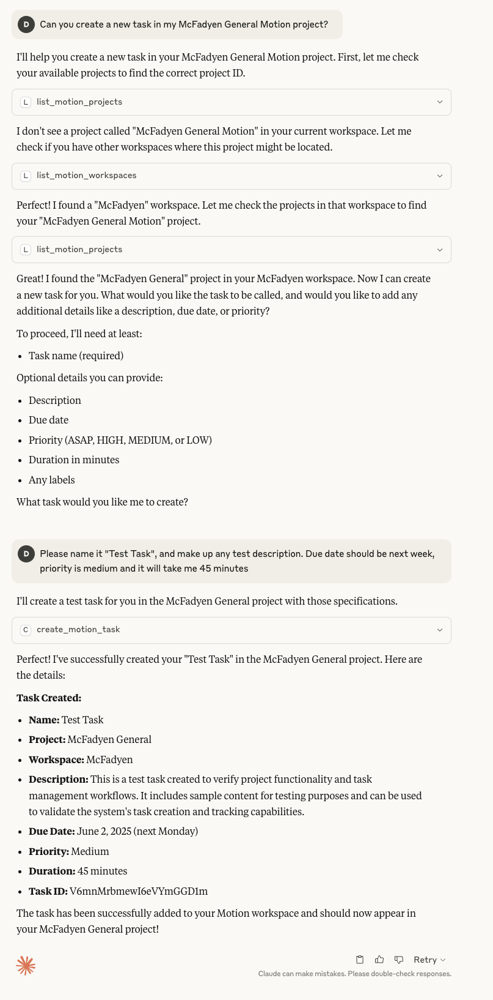

[](https://opensource.org/licenses/Apache-2.0)

# Motion MCP Server

[Motion](https://www.usemotion.com/) is an AI-powered calendar and task management app that auto-schedules your work. This MCP server bridges Motion's API with LLMs like Claude and ChatGPT via the [Model Context Protocol](https://modelcontextprotocol.io/docs/), so you can manage tasks, search projects, check your schedule, and more — all through natural conversation. It works on desktop, web, and mobile.

## Preview

<a href="sample.png"></a>

*Click the image above to view full size*

## Getting Started

**Prerequisites:** Node.js 18+ and a [Motion API key](https://app.usemotion.com/settings/api).

### Local Setup (npx)

For desktop MCP clients — Claude Desktop, Claude Code, Cursor, and similar.

Add to your `claude_desktop_config.json`:

```json
{
  "mcpServers": {
    "motion": {
      "command": "npx",
      "args": ["motionmcp"],
      "env": {
        "MOTION_API_KEY": "your_api_key"
      }
    }
  }
}
```

Test from the command line:

```bash
MOTION_API_KEY=your_api_key npx motionmcp
```

> **Tip:** `npx` always runs the latest published version — no install needed.

### Remote Setup (Cloudflare Workers)

For mobile and web clients — Claude mobile/web, ChatGPT mobile/web, or any HTTP MCP client.

#### One-click deploy

[](https://deploy.workers.cloudflare.com/?url=https://github.com/devondragon/MotionMCP)

After deploy, set your secrets in the Cloudflare dashboard (Workers > your worker > Settings > Variables):
- `MOTION_API_KEY` — your Motion API key
- `MOTION_MCP_SECRET` — a random string (generate with `openssl rand -hex 16`)

#### Manual deploy

```bash
# Set secrets
npx wrangler secret put MOTION_API_KEY
npx wrangler secret put MOTION_MCP_SECRET   # use: openssl rand -hex 16

# Deploy
npm run worker:deploy
```

Your MCP URL will be:
```
https://motion-mcp-server.YOUR_SUBDOMAIN.workers.dev/mcp/YOUR_SECRET
```

#### Connecting from Claude

1. Go to [claude.ai](https://claude.ai) > Settings > Connectors
2. Add your MCP URL
3. The server syncs automatically to the Claude mobile app

#### Connecting from ChatGPT

1. Go to ChatGPT Settings > Connectors
2. Add your MCP URL

> **Security:** The secret in the URL prevents casual discovery. Treat the full URL like a password — don't share it publicly.

Tool configuration works the same as the local server. Set `MOTION_MCP_TOOLS` in `wrangler.toml` under `[vars]`, or override via `wrangler secret put MOTION_MCP_TOOLS`.

For local Worker development, see [DEVELOPER.md](./DEVELOPER.md).

### API Key

The server reads your Motion API key from the `MOTION_API_KEY` environment variable.

**Inline (npx):**
```bash
MOTION_API_KEY=your-key npx motionmcp
```

**`.env` file (when running from source via npm):**
```bash
MOTION_API_KEY=your-key
```

> When using `npx`, prefer the inline environment variable since `npx` won't read a local `.env` file.

## Tool Configuration

All 10 tools are enabled by default. If you run multiple MCP servers and want to reduce tool selection noise, you can limit which tools are exposed via the `MOTION_MCP_TOOLS` environment variable:

| Level | Tools | Description |
|---|---|---|
| **minimal** | 3 | Tasks, projects, workspaces only |
| **essential** | 7 | Adds users, search, comments, schedules |
| **complete** (default) | 10 | Full API access including custom fields, recurring tasks, statuses |
| **custom** | varies | Pick exactly the tools you need |

Custom example:
```bash
MOTION_MCP_TOOLS=custom:motion_tasks,motion_projects,motion_search npx motionmcp
```

## Tools Reference

### motion_tasks
**Operations:** `create`, `list`, `get`, `update`, `delete`, `move`, `unassign`

The primary tool for task management. Supports all Motion API parameters including `name`, `description`, `priority`, `dueDate`, `duration`, `labels`, `assigneeId`, and `autoScheduled`. You can reference workspaces and projects by name — the server resolves them automatically.

```json
{
  "operation": "create",
  "name": "Complete API integration",
  "workspaceName": "Development",
  "projectName": "Release Cycle Q2",
  "dueDate": "2025-06-15T09:00:00Z",
  "priority": "HIGH",
  "labels": ["api", "release"]
}
```

### motion_projects
**Operations:** `create`, `list`, `get`

Manage Motion projects. Workspace and project names are fuzzy-matched, and the server auto-selects your "Personal" workspace if none is specified.

```json
{"operation": "create", "name": "New Project", "workspaceName": "Personal"}
```

### motion_workspaces
**Operations:** `list`, `get`

List and inspect workspaces.

### motion_users
**Operations:** `list`, `current`

List users in a workspace or get the current authenticated user.

### motion_search
**Operations:** `content`

Search tasks and projects by query across a workspace.

```json
{"operation": "content", "query": "API integration", "workspaceName": "Development"}
```

### motion_comments
**Operations:** `list`, `create`

Read and add comments on tasks and projects.

```json
{"operation": "create", "taskId": "task_123", "content": "Updated the API endpoints as discussed"}
```

### motion_schedules
**Operations:** `list`

Retrieve user schedules and time zones. Supports prioritized scheduling with conflict detection and workload breakdowns by status, priority, and project.

### motion_custom_fields
**Operations:** `list`, `create`, `delete`, `add_to_project`, `remove_from_project`, `add_to_task`, `remove_from_task`

Define and manage custom fields across workspaces, projects, and tasks.

```json
{
  "operation": "create",
  "name": "Sprint",
  "type": "DROPDOWN",
  "options": ["Sprint 1", "Sprint 2", "Sprint 3"],
  "workspaceName": "Development"
}
```

### motion_recurring_tasks
**Operations:** `list`, `create`, `delete`

Manage recurring task templates.

```json
{
  "operation": "create",
  "name": "Weekly Team Standup",
  "recurrence": "WEEKLY",
  "projectName": "Team Meetings",
  "daysOfWeek": ["MONDAY", "WEDNESDAY", "FRIDAY"],
  "duration": 30
}
```

### motion_statuses
**Operations:** `list`

List available statuses for a workspace.

## Advanced Configuration

**Minimal setup (3 tools only):**
```json
{
  "mcpServers": {
    "motion": {
      "command": "npx",
      "args": ["motionmcp"],
      "env": {
        "MOTION_API_KEY": "your_api_key",
        "MOTION_MCP_TOOLS": "minimal"
      }
    }
  }
}
```

**Custom tools selection:**
```json
{
  "mcpServers": {
    "motion": {
      "command": "npx",
      "args": ["motionmcp"],
      "env": {
        "MOTION_API_KEY": "your_api_key",
        "MOTION_MCP_TOOLS": "custom:motion_tasks,motion_projects,motion_search"
      }
    }
  }
}
```

**Using your local workspace (npm):**
```json
{
  "mcpServers": {
    "motion": {
      "command": "npm",
      "args": ["run", "mcp:dev"],
      "cwd": "/absolute/path/to/your/MotionMCP",
      "env": {
        "MOTION_API_KEY": "your_api_key"
      }
    }
  }
}
```

See the full developer setup in [DEVELOPER.md](./DEVELOPER.md).

## Debugging

- Logs output to `stderr` in JSON format
- Check for missing keys, workspace/project names, and permissions
- Use `motion_workspaces` (list) and `motion_projects` (list) to validate IDs

```json
{
  "level": "info",
  "msg": "Task created successfully",
  "method": "createTask",
  "taskId": "task_789",
  "workspace": "Development"
}
```

## License

Apache-2.0 License

---

For more information, see the full [Motion API docs](https://docs.usemotion.com/) or [Model Context Protocol docs](https://modelcontextprotocol.io/docs/).
